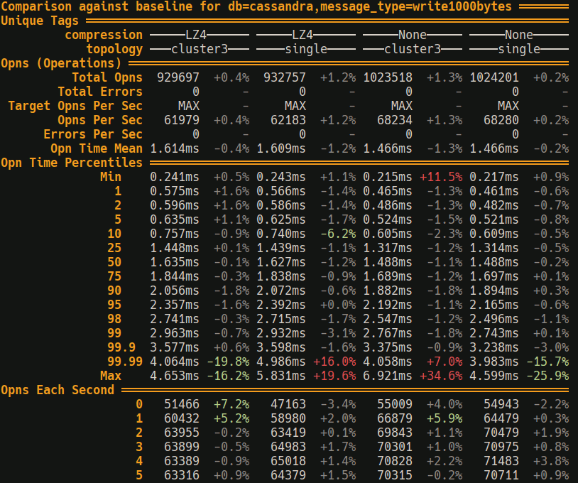

+++
title = "Benchmark tooling needs to be better"
date = 2024-05-04
draft = true
+++

I've long understood that benchmarking is a fundamental part of writing efficient software.
But after spending a lot of time writing benchmarks its become clear to me that the existing tooling around writing, running and analyzing benchmark results is painfully limited.
<!-- more -->

Now to be fair things are improving!
The recent appearance of projects like [divan](https://github.com/nvzqz/divan) and services like [bencher.dev](https://bencher.dev/) and [codspeed](https://codspeed.io) show that others see the same problems that I am seeing.
But I'm writing this all out to show where we are at and what the next steps are.

## What I need from benchmark tooling

A quick run of features I need:

* benches complete as quickly as possible, while still giving meaningful data.
* compare against runs
* measurements taken + results displayed in a way relevant to the task at hand
* Integration with `cargo bench` or a cargo custom command

We want to approach determinism. So we should disable things like:

* Hyper-threading
* frequency scaling
* ASLR (Address Space Layout Randomization)
* maintenance tasks like automatic OS updates while benches are running

While disabling these makes the benches less realistic, its worth it for reducing noise in the results.

Also, the benchmarks clearly cant actually be running locally on the developers machine unless we expect them to shutdown all applications and disable important system functionality.

For some cases of non-determinism we want to be able to explicitly test both the good or bad cases:

* cold + warm cpu cache testing
* Control over whether the allocator will have memory ready to go or needs to request more from the OS.
  * [Example of what can go wrong](https://quickwit.io/blog/performance-investigation)

Profiling the benchmark needs to be a single CLI flag away.
We need flags to enable the collection and reporting of:

* instrumenting profiler (if the project has been instrumented)
* sampling profiler
* CPU cache utilization stats
* memory allocation stats

## Where we are

Here is a quick whirlwind through various benchmarking frameworks and related tooling.
As you'll see no combination of them provides what I need.

### Criterion

Criterion is the current go to for benchmarking in rust.
But it has some serious problems:

* Benchmarks take multiple seconds to complete
* Hard to quickly discern benchmark results
* Largely unmaintained
* Benches are run locally

### Divan

Divan is improving the situation.
But has a critical limitation:

* it is missing cross-run comparisons
* Benches are run locally

### Bencher.dev

bencher.dev exists.

### codspeed

I am pretty excited about codspeed:

* simple to setup:
  * swap criterion dep for codspeed-criterion-compat
  * Add a github actions workflow
  * Enable codspeed app for your github repo
* uses instruction counting so it can run in CI without being affected by the noisy shared hosting.
* those super cool flamegraphs

Some problems are:

* Need to use criterion
* Lacks measurements of walltime
  * Something like adding a 10s sleep will go completely unnoticed

### rustc-perf

<https://kobzol.github.io/rust/rustc/2023/08/18/rustc-benchmark-suite.html>

### Samply

A far more integrated sampling profiler solution than the traditional `perf -> perl flamegraph` solution.

## Analysis of current tools

For running microbenchmarks locally we have criterion and divan, both of them lacks important features that the other has.
But not for any fundamental reason, its just lack of active maintainership holding them both back.
There are also features that both of them lack.
But you can at least pick one or the other or another tool entirely and fulfil some of your needs.

For running benchmarks in CI codspeed gets a bunch of things right but lacks any kind of walltime measurement.

## Solutions

To form a better ecosystem of benchmark tooling I propose the following:

* microbenchmark frameworks should be designed around:
  * running on a remote machine tuned for determinism.
  * running benches in both optimal/suboptimal non-deterministic conditions.
* Introduce a new kind of benchmark framework: integration benchmarking framework
* micro+integration benchmark frameworks need closer integration with profiling tooling.
* micro+integration benchmark frameworks need to be able to run in CI to catch regressions and evaluate improvements

I will explore these solutions in the rest of this article.

## integration benchmarks???

What are usually called benchmarking frameworks are in reality all "microbenchmarking frameworks".
Designed around measuring small changes in short sections of code.
Rusty integration level benchmarking frameworks currently don't exist.
But I'm fixing that because they really should!
They should be tailored to measuring the far noisier world of applications, services and databases.

Ok so database specific benchmarking tools certainly exist, projects like [latte](https://github.com/pkolaczk/latte).
But I am proposing that we need generic frameworks to easily enable the creation of these kinds of benchmarks for a wide variety of applications.

### What needs do integration level benchmarks have?

Integration benchmarks benefit from "parameterization" taken to the extreme, while microbenchmarks only need a basic level of "parametrization".
This is because at a high level there are far more combinations of different configurations available.

Integration benchmarks also want to spin up resources.
In the simplest case, this would be just a single application binary.
But on the more complex end, this could look like spinning up multiple cloud instances with a database, service and client all running on different instances.
So we want the framework to provide resource management, to ensure each bench can efficiently create any resources it needs.

### A possible solution: windsock

At my employment I have had the opportunity to actually tackle this problem and wrote the [windsock](https://github.com/shotover/windsock) integration level benchmarking framework.
You provide windsock with:

* define your benchmarks
* define how to setup cloud instances needed for your benchmark.
  * You should setup your instances as close as possible to your production setup.

Windsock will then run your benchmarks locally or in the cloud,

And then windsock will provide you with a CLI from which you can:

* Query available benchmarks
* Run benchmarks matching specific tags.
  * windsock can automatically or manually setup and cleanup required cloud resources
* Process benchmark results into readable tables
  * Baselines can be set and then compared against

Example benchmark results from windsock, comparing against a baseline for some cassandra benchmarks:

I use windsock often at work and can reccomend giving it a go if you need integration level benchmarks.
Windsock is designed to be general, but at the same time its featureset is just whatever we found we needed at work.
There's lots of room in this space, I would love to see other alternatives pop up.

## Remote running microbenchmarks

Moving microbenchmarks to be run on a remote machine by default solves a whole bunch of problems:

* The server can be configured to run more deterministically then a dev machine.
  * More accurate results
  * Less fussing around by the developer - Do I need to close my IDE and browser while running benches?
* Multiple server's can be setup allowing different CPU architectures and OS's to be tested concurrently
* Benchmarks can be run in CI with accurate walltime measurements.

### The downside

There is however one downside to remote running microbenchmarks.
The initial and ongoing maintenance cost of running a server.

There are two approaches that can be taken here:

* Running an SBC (single board computer) from your home network.
* Renting a small bare metal server, they cost ~$70AUD a month at places like hetzner.

Using shared cloud instances is no good since they are too noisy.

To minimize the barrier to entry here we need trivial setup for the most popular SBC, the raspberry pi.
There should be a program that will generate a ready to go raspberry pi OS running the benchmarker and then flash the image to the SD card.
This image should have all the required OS tweaks to increase determinism.

This infrastructure would be run on a per project basis.
Config files pointing at the bench runner server should be checked into the project.
However individual user key's should be manually handed out to contributors, set in an env var, to avoid abuse of the compute.

### A possible solution: Ussal Bench

In my free time I've been tinkering with a remote benchmark runner called [ussal](https://github.com/rukai/ussal-bench).
It provides a server and a client.
The client compiles benchmarks, sends them to the server, receives the results, analyzes them and presents them to the user.
The server receives the benchmarks, runs them in a sandbox and then sends the results back to the client.

Ussal client and server can run criterion benchmarks together, and even generate these [cool graphs in CI](https://rukai.github.io/ussal-bench/)
But ussal is not usable yet.
It contains some interesting ideas but also needs a lot of work and rework.

## Run benches in optimal/pessimal system state

The state of the OS and hardware can have a huge effect on performance.
Things like the memory allocator and cpu caches.
The benchmark framework should be able to setup the allocator and cpu caches to be in an optimal or pessimal state.
This could look like automatically generating variants of all benchmarks that runs with each system state.
Or maybe the developers just add a `#[bad_alloc]` or `#[good_alloc]` to the bench definition as needed.

I have no idea how to actually implement the technical side of this, but I have seen some crazy things before like [putting the branch predictor in a randomized state](https://github.com/Voultapher/sort-research-rs/blob/b7bcd199e861d6f8b265164242f3c34d5c36c75f/benches/trash_prediction.rs#L7).
And I think that solving this problem would be a huge win.

### What next?

I've covered a bunch of limitations of current benchmark tooling.
Some of the limitations need deep research, possibly even changes at the hardware or operating system level.
But a lot of the limitations are just that we don't provide comprehensive ready to go solutions for these problems.
Instead everyone has to cobble together their own half-baked solution.

Theres honestly so much room for improvement here, and space for competing tools that you could pick an area that interests you and just start prototyping.
But if you want some existing projects to contribute to, windsock or ussal may interest you.

## Other resources

* Nikolai Vazquez, author of divan, gave an excellent talk [Proving Performance](https://www.youtube.com/watch?v=P87C4jNakGs)
  * He also wrote a similar [article](https://nikolaivazquez.com/blog/divan) on divan
* [Latte](https://github.com/pkolaczk/latte), a cassandra benchmarking tool, was a strong inspiration for windsock's table output
