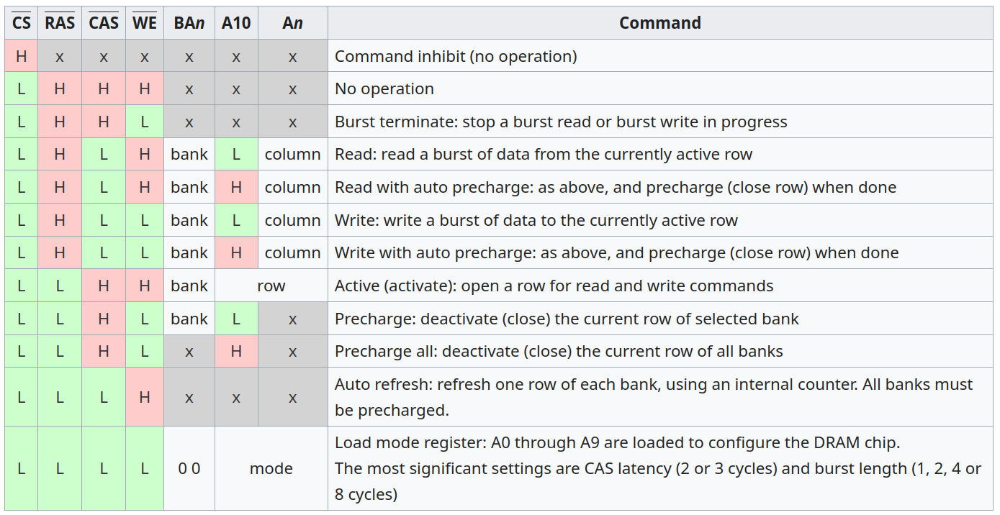

+++
title = "Building a dev machine in Oct 2024"
date = 2024-10-27
+++

This article discusses my approach to building a Linux development machine in Australia for writing rust projects with a software engineers salary.
<!-- more -->
If you don't fit into this exact niche this article might not be for you.

With the release of the ryzen 9xxxx CPUs I decided it was time to upgrade my development system.

While my system still runs excellently, I'm always waiting on rust compiles. A debug clippy run takes 5-10s which is run every time I hit save. Halving this would be a huge win, reducing the raw amount of time I spend waiting, while also improving flow/concentration.

And from looking at some benchmarks, it looked like I would be able to achieve exactly that by upgrading to a 9950x which is a similar price to my old 3900x when I originally bought it. This seems to me like a reasonable approach to upgrades as we bask in the dying light of moores law: if you can buy new parts for a similar price to the original system that halve your compile times, do it! For me it took 4 years for this to occur, which doesn't seem too wasteful.

## CPU

I think the easiest choice of this build was the CPU.

All Intel chips can be ruled out from the chip destroying stability issues they have in their current 13th and 14th gen chips.

That leaves the AMD lineup which is fairly straightforward at the moment.
There are ryzen 7000 series thread ripper chips but they won't meet the single threaded performance of the ryzen 9000 chips.
So unless you need to be rebuilding something like llvm all the time, the ryzen 9 chips are going to be faster for warm recompiles and significantly cheaper!
Usually the best chip of a lineup has a big jump in price over the second best chip. But that is not the case for ryzen 9000!
The 9950x is only $150 more at $649 USD.

So at least for me the 9950x was a clear winner.

## CPU cooler

The thermalright peerless assassin 120mm performs well enough on the noise normalized measurements while only costing $65

## SSD

I initially thought that a fast SSD would significantly help debug builds since debug builds of a medium sized project will write multiple GBs of intermediate files to disk.
I ran an experiment to demonstrate this bottleneck but found that the speed of the SSD is irrelevant, at least for the project I tested on.

On my old 3900x system I built the [rust project I develop at my day job](https://github.com/shotover/shotover-proxy) in two different scenarios:

* project freshly cloned into a 16GB tmpfs
* project freshly cloned into an intel 660p SSD (a budget SSD from 4 years ago)

I observed no difference in build times between these 2 test cases.
From this I concluded that for a medium sized project:

* Compiling in a ramdisk doesnt help
* SSD speeds don't impact build times

Why did we get these results?
I believe its because linux uses unused RAM to cache reads and writes, giving similar benefits to a ramdisk.
But I'm not super familiar with this stuff.

Modern 2-4tb m.2 drives can be purchased for reasonable prices.
I got the corsair MP600 elite 2TB because it has the best random IOPS and was available for cheap, but anything from a reputable brand with reasonable speed and endurance will be fine.
For an extensive performance comparison: <https://www.tomshardware.com/features/ssd-benchmarks-hierarchy>
To see endurance look at the manufacturers specs of the particular SSD and look for something like "TBW" (terrabyte written) or "DWPD" (drive writes per day)

## RAM

First, when working with modern DDR5 RAM:

* Always buy your RAM in a kit containing multiple sticks of ram, kits group together sticks of similar timings to ensure they can work together well.
  * Previous generations were more flexible with this but don't muck around with this in DDR5.
* Unless you are working with huge workloads buy a kit of 2. The more sticks the harder it is for them to work together.

[This excellent analysis](https://www.techpowerup.com/review/ddr5-memory-performance-scaling-with-amd-zen-5/2.html) of how different DDR5 RAM kits perform with zen 5 is a must read. (make sure to click through to other pages at the bottom)

The key take away from the article is: go with 6000mhz ram exactly.

Why?
The RAM clock speed is important, and this can be seen where performance drops off at any speed below 6000mhz.
But above 6000mhz any returns are hard to discern from noise.
As the article explains, above 6000MHZ the memory controller in the CPU has to run in a special mode to keep up with the RAM speeds.
This eventually starts to yield good results in really high frequencies, but in the currently commonly available kits of 6000-8000MHZ the results are really spotty.
Once [kits like this](https://www.tomshardware.com/pc-components/ram/g-skill-launches-ddr5-9600-cudimm-ram-can-hit-ddr5-10000-in-dual-channel-mode-on-air-cooling) become commonly available it will probably make sense to go beyond 6000MHZ

However there is one other quality of RAM not described by its clockrate.
There are also latency ratings given in formats like:

* CLX (e.g. CL30)
* CLXX-XX-XX-XX (e.g. CL30-36-36-76)
* XX-XX-XX-XX (e.g. 30-36-36-76)

In all of these the first XX is the CL (CAS latency)
In the last two formats the first is CL, then RCD, then RP, then RAS. (CL-RCD-RP-RAS)

What the hell is that?
Well these latencies describe how many clock cycles it takes for different DDR operations to complete.
Turns out the cpu reads and writes to the RAM via a series of commands.

My understanding is that you can read the latencies as:

1. best case access latency: CAS
2. 2nd best case access latency: CAS+RCD
3. 3rd best case access latency: CAS+CRD+RP
4. 4th best case (worse case) access latency: CAS+CRD+RP+RAS

And then finally ram size.
The higher capacity the RAM the harder it is to find good clock rates and latency.

I recommend 64gb, more room to cache SSD, more room to run multiple IDEs.
But 32GB is also reasonable and you might find better latency kits.

But remember that while 6000mhz ram is supported by the CPU, motherboard and the RAM itself.
According to the JEDEC standard it is technically overclocking.
So you will need to manually enable EXPO setting in the BIOS to make your RAM run at its rated 6000mhz rating.
Don't forget this or you will take a real performance hit.

## Motherboard

Need to accommodate all the parts you've chosen.
Things to check:

* Case USB front panel compatibility
* M.2 SSD pcie compatibility
* Graphics card pcie compatibility
* CPU chip compatibility
  * (if the bios needs to be updated for a 9950x can that be done without a CPU?)
  * VRMs deliver enough power for the CPU, best to check what reviewers say.
* Fits in case mATX/ATX/ITX

If mATX get a wifi version, won't fit a wifi card in with a modern graphics card.

## PSU

You might be familiar with the "80 plus" PSU ratings.
That rating system has a lot of issues, and you are better off consulting the Cybenetics ratings which are far more in depth.
They also have a [fantastic website](https://www.cybenetics.com/index.php?option=power-supplies&params=6,1,0) listing out all the power supplies they have evaluated which makes picking out a PSU a lot easier.

It's common knowledge that you need to closely match your PSU to your power usage for power efficiency reasons.
However from looking at these cybenetics reports I learnt that in EU/Aus it's actually not nearly as important.
Look at this graph!

<https://www.cybenetics.com/evaluations/psus/2478/>

## Case

Presumably you can just keep your old case, might not be the most up to date airflow conducive design, but at worst the fans will be a slightly louder to compensate.

Alternatively if you are upgrading absolutely everything, consider getting a new case so you can sell your old system second hand as a complete unit. A generation old development machine would make for an reasonable base for a gaming machine, just install a better GPU (and probably upgrade PSU too)
