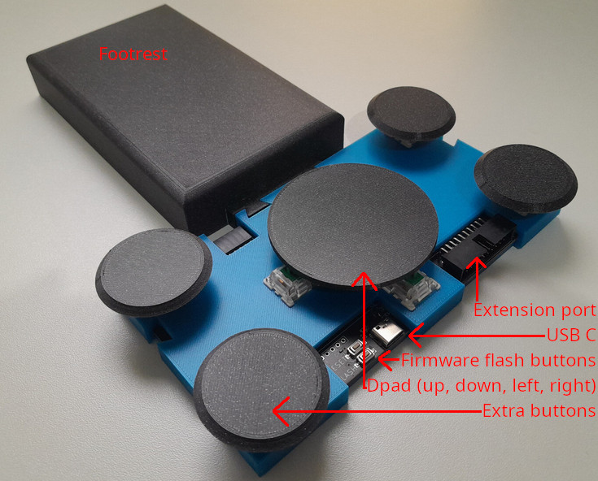

+++
title = "DPedal"
date = 2023-03-23
+++

A large foot controlled DPad.
<!-- more -->
It connects to your PC over usb 2.0 on a usb C port and sends user configurable HID keyboard events.

It consists entirely of [3d printed parts](https://cad.onshape.com/documents/b3650977a607511c32026f52/w/79027c5ddd8ad99ee7db1e2a/e/7192077cb58abe7f31bd20c3?renderMode=0&uiState=63ad8d5084623c01cce27891) except for the [PCB](https://github.com/rukai/DPedal/tree/main/PCB) and keyboard switches.
You can build your own from this design if you are comfortable with 3d printing, ordering assembled PCB's from a manufacturer and a tiny bit of soldering.
The configuration is stored in a config file and is put on the device along with the [firmware](https://github.com/rukai/DPedal/tree/main/dpedal_firmware) by the [flashing tool](https://github.com/rukai/DPedal/tree/main/dpedal_flash).

## Project status

The dpad design is functional and can be built following the [instructions in the repo](https://github.com/rukai/DPedal#manufacturing).
