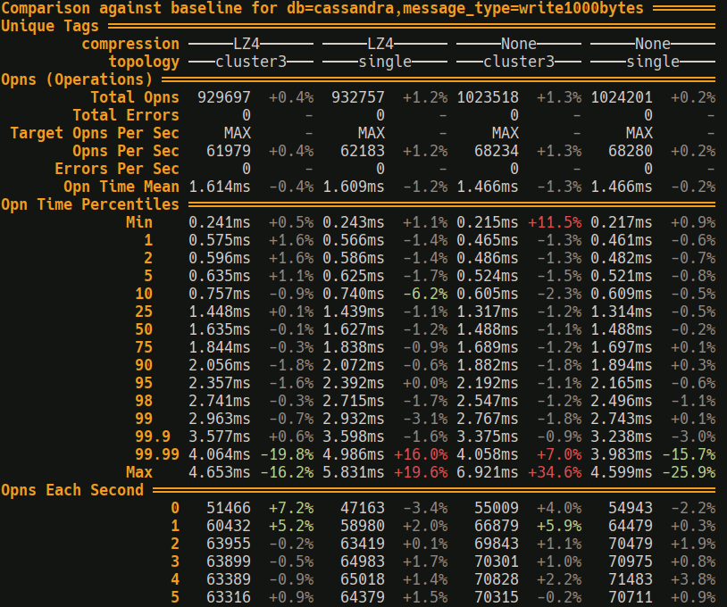

+++
title = "Reimagining Benchmark Tooling"
date = 2024-07-16
+++

I've long known that benchmarking is key to writing efficient software.
But after writing a lot of benchmarks I've seen how the existing tooling for writing and running benchmarks has some fundamental issues.
<!-- more -->

Now to be fair, things are improving!
Recent projects like [divan](https://github.com/nvzqz/divan) and services like [bencher](https://bencher.dev/) and [codspeed](https://codspeed.io) show that others see the same problems.
But I think we could do with rethinking how we approach benchmarking.

## Existing tools

But before I get to that, I think its important to start with the existing tools.
<!--So here is a quick whirlwind through various benchmarking frameworks and CI tooling.-->

### Criterion

[Criterion](https://github.com/bheisler/criterion.rs) is the current go to for benchmarking in rust.
But it has some serious problems:

* Each benchmark takes multiple seconds to complete and results are still noisy.
* Benchmark results are buried in less important details.
* Largely unmaintained

### Divan

[Divan](https://github.com/nvzqz/divan) is improving upon the criterion status quo but:

* It is still missing cross-run comparisons
* The results are noisy.

### Bencher

[Bencher](https://bencher.dev) is a service which tracks benchmark results over time.
It seems neat but I can't find a way to run noise-free benches in CI.
It could be used as a component within a complete benchmarking solution though!

### codspeed

I am pretty excited about [codspeed](https://codspeed.io/):

* It uses instruction counting so it cuts the noise of shared hosting in CI.
* It also has these really cool flamegraph diffs in the CI output, so its not just measuring the PR’s performance impact, but also shows why there’s an impact

Some problems with codspeed are:

* The project needs to use a fork of criterion
* Lacks measurements of walltime

### rustc-perf

[rustc perf](https://kobzol.github.io/rust/rustc/2023/08/18/rustc-benchmark-suite.html) has been around for a while and has been my hint that, "hey, things can be better".
It nails pretty much everything:

* Measures both instruction count and wall time
* Results are tracked in CI, generating graphs for viewing trends over time.
* Runs benches on a remote machine configured for running benchmarks with minimal noise.

One downside is that there is no way to run certain benches remotely without going through the lengthy CI process.
But ultimately none of this matters since it is inaccessible to every project that isn't rustc. 😭
It is however a very good reference of what is possible.

<!--
### Samply

A far more integrated sampling profiler solution than the traditional `perf -> perl flamegraph` approach.
Has its own implementation of sampling profiler and displays results in the firefox profiler web UI.
Samply is very cool but it would become even more convenient if we took integration a step further and `cargo bench – –profiler samply` was all it took to profile your benches, in the process filtering out all the noise from the bench runner.
-->

### Conclusion

<!--
* I need to be able to run benchmarks in CI
  * I am only human, issues will slip through unless I regression test performance.
* I need my benchmark results to be free of noise, both locally and in CI
  * My benchmarks are always noisy and it makes working on performance much harder than it should be.
-->

Even with all these tools there are still many holes in the ecosystem.
Running benchmarks noise-free locally is very difficult and the situation is far worse in CI.
And all these tools are focused on measuring performance at the microbenchmark level.
While its possible to use them for measuring integration level performance they are not well suited for that task.

<!--
## Analysis of current tools

For running microbenchmarks locally we have criterion and divan, both of them lack important features that the other has.
But not for any fundamental reason, it's just lack of active maintainership holding them both back.
There are also features that both of them lack.
But you can at least pick one or the other or another tool entirely and fulfil some of your needs.

For running benchmarks in CI codspeed gets a bunch of things right but lacks any kind of walltime measurement.
-->

<!--
## where we fall short

-->

## Reimagining benchmarks

The core problem I wanted to solve was that of noise.
I realized that to make a real impact on noisy benchmarks, its not enough to just perform fancy statistical analysis.
We also need to actually reduce the noise that benchmarks experience in the first place.
And to do that, we need to run all of our benchmarks on machines tuned for determinism.

However I noticed that we also want to benchmark performance at an integration level.
It wouldn't make sense to run those benchmarks on a single machine, it would be much better to run those benchmarks with multiple cloud instances setup the same way they are in production.
Combined with my poor past experience of writing integration level benchmarks with criterion, it became clear that we need new benchmark frameworks targeted solely at integration level benchmarking.

Which leads me to my conclusion.
To form a better ecosystem of benchmark tooling we need to make the following two changes:

1. Introduce a new kind of benchmark framework: The “integration benchmarking framework”
   * Prioritizing accuracy over noise reduction.
2. Microbenchmark frameworks should be designed around running on a remote machine tuned for determinism.
   * Prioritizing noise reduction over accuracy.

<!--
In this way, with a suite of both microbenchmarks and integration benchmarks you can understand your system's performance at a high level with integration benchmarks and then dive down into the details with microbenchmarks.
-->

I will explore what these changes to the ecosystem could look like in the rest of the article.

## Integration Benchmarks???

What we usually call benchmarking frameworks are really more "microbenchmarking frameworks".
They're meant for measuring changes in short sections of code.
Designed around measuring small changes in short sections of code.
Rusty integration level benchmarking frameworks currently don't exist.
But I'm fixing that because they really should!
They should be tailored to measuring the far noisier world of applications, services and databases.

Ok so database specific benchmarking tools certainly exist, projects like [latte](https://github.com/pkolaczk/latte) for example.
But I believe we need generic frameworks to enable writing benchmarks for lots of different applications.

### What needs do integration level benchmarks have?

<!--
// I think this should be cut since its a bit wishy washy
Integration benchmarks benefit from "parameterization" taken to the extreme, while microbenchmarks only need a basic level of "parametrization".
This is because at a high level there are far more combinations of different configurations available.
For example criterion will allow benches to be parameterized with [multiple versions of a bench](https://github.com/bheisler/criterion.rs/blob/f1ea31a92ff919a455f36b13c9a45fd74559d0fe/benches/benchmarks/compare_functions.rs#L33), resulting in separate benches e.g. `Fibonacci3/Iterative/20`, `Fibonacci3/Iterative/21`.
But parametrization for integration benches should go much further.
-->

A microbenchmark is largely concerned with how long does a certain chunk of code take to run.
However, since integration benchmarks are much higher level they need to take into account a lot more context.
For a database or service the following needs to be measured and reported:

* Operations per second
* Operation latency
  * Ideally broken down into percentiles
* Internal system metrics

For applications you would probably want to measure something like response times on UI interactions.

Integration benchmarks also want to spin up resources.
In the simplest case, this would be just a single application binary.
But on the more complex end, this could look like spinning up multiple cloud instances with a database, service and client all running on different instances.
So we want the framework to provide resource management, to ensure each bench can efficiently create any resources it needs.

As you can see, all of this stuff is meaningless to a microbenchmark and trying to jam it into a microbenchmarking framework would result in something that is too generic and not well suited to either task.

### A possible solution: windsock

At my job I have had the opportunity to actually tackle this problem and wrote [windsock](https://github.com/shotover/windsock) an open source integration level benchmarking framework.

As an author of benchmarks, you provide windsock with:

* Your benchmark implementations
* Optionally, logic for setting up cloud instances needed for your benchmarks.
  * Ideally as close as possible to your production setup.

And then windsock will provide you with a CLI from which you can:

* Query available benchmarks
* Run benchmarks matching specific tags.
  * These benchmarks can be run locally or in cloud instances.
* Manually spin up cloud resources
  * This allows instances to be reused across runs, reducing noise.
* Process benchmark results into nicely formatted tables
* Set the last run as a baseline, all future runs will automatically compare against that baseline.

Example benchmark results from windsock, comparing against a baseline for some cassandra benchmarks:

I use windsock often at work and can recommend giving it a go if you need integration level benchmarks.
Windsock is designed to be general, but right now its featureset is only what we needed at work.

## Remote running microbenchmarks

Now back to the second proposed change to the ecosystem, moving microbenchmarks to be run on a remote machine.
"Remote" by default solves a whole bunch of problems:

* The server can be configured to run more deterministically than a dev machine.
  * More accurate results
  * Less fuss by the developer - Am I really going to close my IDE and browser to run benches?
* Multiple servers can be setup so different CPU architectures and OS's can be tested concurrently
* Benchmarks can be run in CI with accurate walltime measurements.

### noise-reduction configuration

In order to reduce noise, the machine needs to be closer to the deterministic ideal it is pretending to be.
So we should disable things like:

* Hyper-threading
* frequency scaling
* ASLR (Address Space Layout Randomization)
* All non-essential background processes and applications
  * Tasks like automatic OS updates should be paused while benches are running

While disabling these technically makes the benches less realistic, it's worth it for reducing noise in the results.
If you want realism, write an integration benchmark!

However, try convincing a dev they should configure their machine this way! Not a chance.
Therefore, the only way to get devs to run their benches in such conditions is tooling for remote bench running.

### The downside

There is however one downside to remote running microbenchmarks: the cost of running a physical server.

After all, shared cloud resources are noisy.
So, there are two options here:

* Running an SBC (single board computer) from your home network.
* Renting a small bare metal server, they cost ~$70AUD a month at places like Hetzner.

For a low barrier to entry we need trivial setup for the most popular SBC, the raspberry pi.
There should be a program that will generate a ready to go raspberry pi OS running the benchmarker and then flash the image to the SD card.
This image should have all the required OS tweaks to increase determinism.

This infrastructure would be run on a per project basis.
Config files pointing at the bench runner server should be checked into the project.
However individual user key's should be manually handed out to contributors to avoid abuse of the compute.

### A possible solution: Ussal Bench

In my free time I've been tinkering with a remote benchmark runner called [ussal](https://github.com/rukai/ussal-bench).
It provides a server and a client.

The client compiles benchmarks, sends them to the server, receives the results, analyzes them and presents them to the user.
The server, called a runner, receives the benchmarks, runs them in a sandbox and then sends the results back to the client.

The fleet of runners can be setup:

* with different hardware and software configurations to test performance on many possible user or server devices.
* with identical hardware and software configurations to concurrently run benches across multiple machines.

Runners can also be run on a home network without exposing any ports to the internet.
This is enabled by the orchestrator which can be run cheaply in a shared cloud instance and proxies requests to the physical servers.

Ussal client and server can run criterion benchmarks together.
The ussal client can remotely run benches compiled on your local machine, giving devs immediate feedback on their benchmarks, right in their terminal.

The ussal client can also run in CI, generating these [webpages with cool egui graphs](https://rukai.github.io/ussal-bench/).
The goal is for a standard configuration of ussal in github actions to trigger a CI run:

* on PR merge - adding another entry point to each benchmarks graph
* on PR creation/update - The PR is included in the graph, to compare against the history.

But ussal is just a hobby project of mine and not usable yet.
It contains some interesting ideas but also needs a lot of work and rework.

<!--
## Bonus ideas

Here are some bonus ideas, that didnt fit into the rest of the article but that I also want to see happen.

### Run benches in optimal/pessimal system state

The state of the OS and hardware can have a huge effect on microbenchmark performance.
Things like the memory allocator and cpu caches.
While we might be able to reduce the noise from these by configuring the machine or running the benchmarks in certain ways.
We should try to do one better.

To truly understand how our code behaves in different scenarios, the benchmark framework should be able to setup the allocator and cpu caches to be in an optimal or pessimal state.
This could look like automatically generating variants of all benchmarks that runs with each system state.
Or maybe the developers just add a `#[bad_alloc]` or `#[good_alloc]` to the bench definition as needed.

I have no idea how to actually implement the technical side of this, but I have seen some crazy things before like [putting the branch predictor in a randomized state](https://github.com/Voultapher/sort-research-rs/blob/b7bcd199e861d6f8b265164242f3c34d5c36c75f/benches/trash_prediction.rs#L7).
And I think that solving this problem would be a huge win.
-->

<!--
* cold + warm cpu cache testing
* Control over whether the allocator will have memory ready to go or needs to request more from the OS.
  * [Example of what can go wrong](https://quickwit.io/blog/performance-investigation)
-->

<!--

### Integrated profiling

Profiling the benchmark needs to be a single CLI flag away.
We need flags to enable the collection and reporting of:

* instrumenting profiler (if the project has been instrumented)
* sampling profiler
* CPU cache utilization stats
* memory allocation stats
-->

### What next?

I hope this article gave you some ideas of what a next generation of benchmark tooling could be like.
If windsock or ussal are exactly what you need, then consider using or experimenting with them:

* [Windsock](https://github.com/shotover/windsock) is largely done, you could be using it today.
* [Ussal](https://github.com/rukai/ussal-bench) is currently unusable but represents a direction for benchmarks that I strongly believe in.

But honestly there's so much room for improvement here and space for competing projects.
So I would love to see new tools for integration benchmarking or remote microbenchmarking.

## Other resources

* Nikolai Vazquez, author of divan, gave an excellent talk [Proving Performance](https://www.youtube.com/watch?v=P87C4jNakGs)
  * He also wrote a similar [article](https://nikolaivazquez.com/blog/divan) on divan
* [Latte](https://github.com/pkolaczk/latte), a cassandra benchmarking tool, was a strong inspiration for windsock's table output
