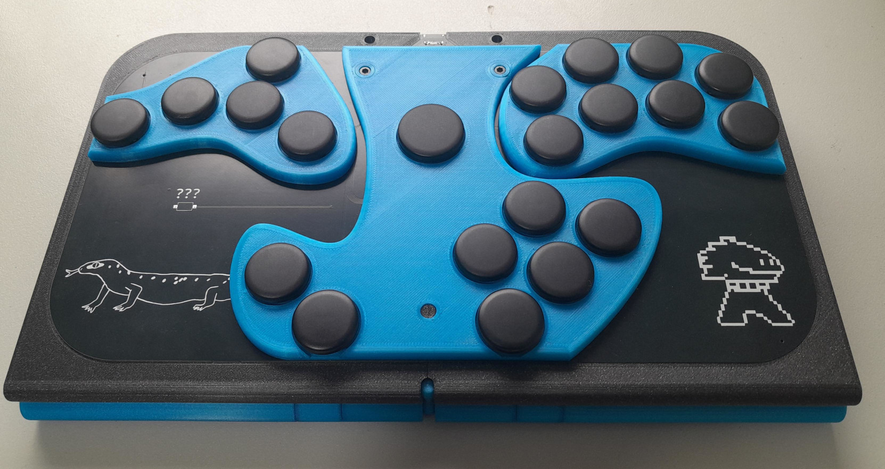
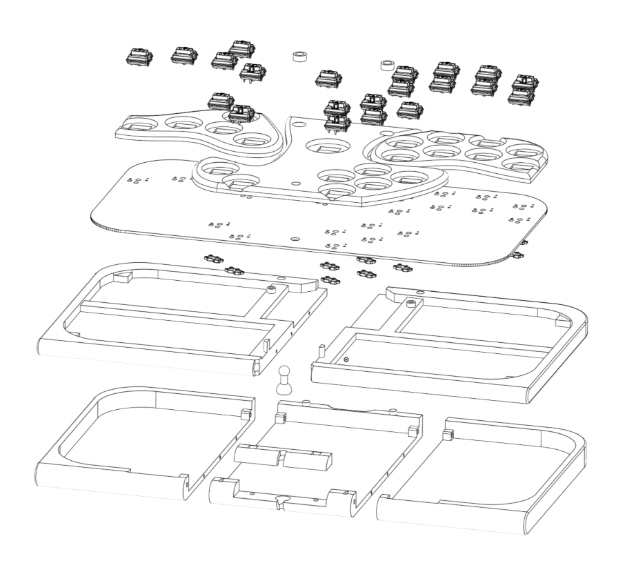

+++
title = "Rukaibox"
date = 2025-03-29
+++

[Rukaibox](https://github.com/rukai/rukaibox) is a hitbox style controller for playing smash games.
<!-- more -->

It consists of:

* A [3D printed enclosure](https://cad.onshape.com/documents/f6e7916fda654a648d842c67/w/2435c624e0afcf5d47216714/e/d2b4fc9888a125d6f744d329?renderMode=0&uiState=6768f678e653c701cfa65dbe) that I designed in onshape
* A [very slightly customized](https://github.com/rukai/rukaibox/tree/main/gram-fork) [gram slim PCB](https://gramctrl.com/products/gram-slim-pcb).
* [Rust firmware](https://github.com/rukai/rukaibox_firmware) that I wrote with reference to the [stock gram slim firmware](https://github.com/GRAMCTRL/HayBox-GRAM).

## Hardware

I was inspired by the custom controllers some of my friends were making and I wanted to have a go at it.
Unlike [dpedal](/depedal), I don't think the rukaibox hardware is generally useful for other people as its very specific to my own personal needs and aesthetics.
That said, I cant resist making things reproducible so I at least wrote up a [BOM](https://github.com/rukai/rukaibox?tab=readme-ov-file#bom) for it.



The black top panel is actually the PCB!
The drawings on it are the silkscreen printed by the PCB manufacturer.

The blue part underneath is a lid that protects the buttons and PCB but flips underneath the controller when in use.

I used a single ball-joint so that the lid can rotate.
This allows the flat surface of the lid to act as both the top of the lid and to form a flat surface underneath that will sit comfortably in your lap while in use.



The 3D printed parts are all designed to fit within the relatively small 180mm printbed size of my prusa mini.

## Firmware

Unlike the enclosure, I could actually see other people using the firmware I wrote for their own controllers.

Currently the standard firmware for the PCB requires modifying C++ code to remap buttons.
I think this is a pretty reasonable way to do remapping as long as the project is easy to build.
Unfortunately its C++ so that is not the case.

So instead, I designed my own firmware to use a configuration file and a flashing tool.
The flashing tool is an executable with the firmware built in.
So the user just needs to modify the provided config file and run the flashing tool to setup their device with their own mapping.
No recompiling or modifying source code required.

Under the hood the flashing tool deserializes the config file and then reserializes it into bytes via [rkyv](https://github.com/rkyv/rkyv).
These bytes are then flashed to a certain location in the flash memory which the firmware can then deserialize via rkyv.

The config file is written in [KDL](https://kdl.dev/) and looks something like this.

```kdl
profiles {
    // Standard Project+ profile
    - {
        // Which firmware level profile logic to use.
        // Controls things like the exact control stick values used under different circumstances.
        // And any other hardcoded special case logic.
        // Possible values:
        // * project-plus
        // * rivals2
        logic project-plus

        // The button combination listed here can be used to jump to this specific profile.
        // A maximum of 10 buttons can be used.
        //
        // On startup the controller will start in the first defined profile.
        // Cut/paste a profile to the first position to make it the default.
        activation-combination {
            - start
            - left-thumb-left
            - left-pinky
        }

        // Possible values:
        // * second-input-priority - when both directions are pressed, the second direction to be pressed is activated.
        // * neutral - when both directions are pressed, neither are activated
        socd second-input-priority

        buttons {
            stick-up right-pinky
            stick-up2 left-middle2
            stick-down left-middle
            stick-left left-ring
            stick-right left-index

            a right-thumb-middle
            b right-index
            x right-middle
            y right-middle2
            z right-ring

            // ... buttons omitted for brevity
        }
    }
    // and define more profiles below...
}
```

I'm still not sure if I really want KDL or if I should just use JSON with comments hacked in. I feel like I'm fighting against the XML style node approach, but the syntax is certainly very clean.
